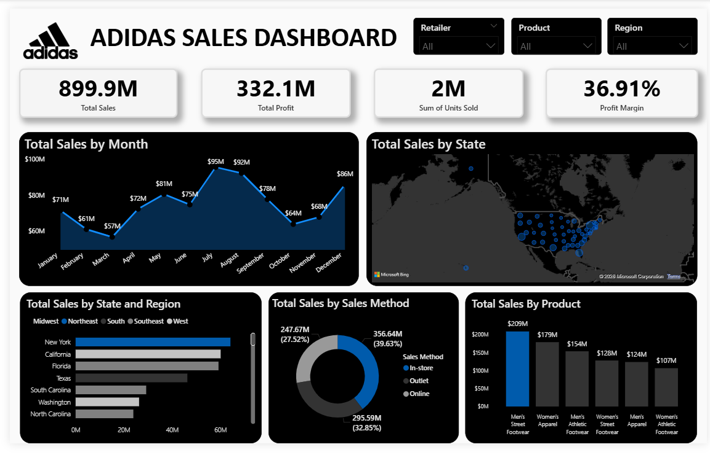

# Adidas Sales Dashboard (Power BI)

## 📊 Overview
This project analyzes Adidas US sales data using Power BI to uncover insights on sales performance, profit trends, and product-level contribution.

## 📷 Dashboard Preview

## 🚀 Key Features
- KPI Cards: Total Sales, Profit, Units Sold, Profit Margin
- Sales Trend Analysis (Monthly)
- Geographic Sales Distribution (Map)
- Product-wise Sales Performance
- Sales Method Analysis (Donut Chart)
- Interactive Filters (Region, Product, Retailer, Date)

## 🎯 Key Insights
- Men's Street Footwear is the top-performing product (~209M sales)
- Strong sales growth observed during mid-year (Q3)
- Majority sales come from In-store and Outlet channels

## 🛠 Tools Used
- Power BI
- DAX
- Data Visualization

## 📂 Files
- `.pbix` file included for full report
- Dataset used for analysis

## 🔗 Connect with me
(http://linkedin.com/in/muhammed-abdulrazak)
